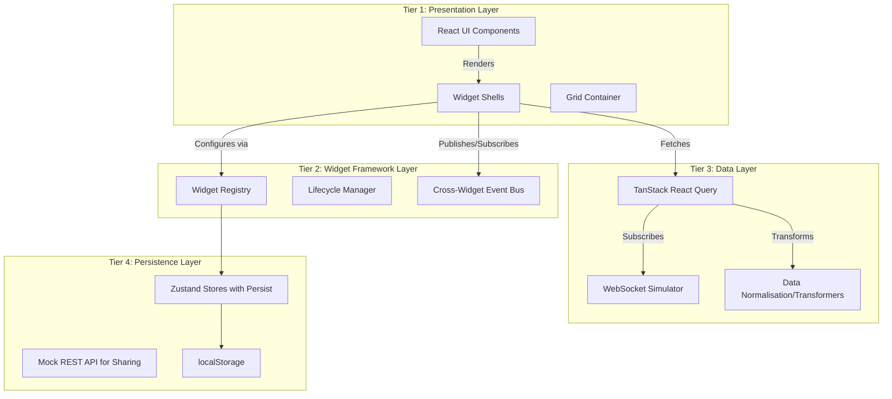

# Meridian Capital Dashboard - Architecture Design

## Layered Architecture

The application is structured into four distinct tiers to ensure strict separation of concerns, scalability, and adherence to institutional-grade resilience:

## Widget API Contract Rationale

The `WidgetDefinition` interface is the backbone of the dashboard's extensibility. It defines a strict API contract ensuring that:
1. **Uniform Registration**: The widget registry manages all widgets uniformly.
2. **Framework Decoupling**: The grid layout renders any widget without needing to know its internal logic.
3. **Type Safety**: By heavily leveraging TypeScript generic types (`TConfig` and `TData`), the API contract enforces strict typing for widget configurations and data binding.
4. **Dynamic Loading**: Integrating `React.LazyExoticComponent` ensures code-splitting is enforced at the widget level, keeping the initial JavaScript payload under the 200KB constraint.

## State Management Strategy

**Why Zustand?**
Redux is explicitly prohibited to avoid boilerplate and excessive bundle size overhead. Zustand is selected because:
- **Minimal Bundle Footprint**: Adds ~1KB, critical for our <200KB main bundle target.
- **Hook-based API**: Allows widgets to subscribe to precise state slices, avoiding unnecessary re-renders.
- **Middleware Support**: Integrates seamlessly with `immer` for immutable updates and `persist` for saving layouts to `localStorage`.

**The 4 Core Stores:**
1. **DashboardStore**: Manages the grid layout state, including positions, sizes, and global grid configurations.
2. **WidgetStore**: Manages instances of widgets and their runtime configurations.
3. **ThemeStore**: Handles the active theme, dynamic theme building state, and custom configurations.
4. **LayoutStore**: Manages saved layouts, version history, and sharing state.

## Data Flow Description

Financial dashboards consume massive amounts of data through multiple asynchronous channels. The data flow architecture uses the following patterns:
- **Stale-While-Revalidate**: We use TanStack React Query to immediately serve cached data while silently fetching fresh data in the background. This ensures sub-100ms UI responsiveness even when network requests suffer from latency.
- **WebSocket Streaming**: Used as the primary mechanism for real-time price and ticker updates (simulated).
- **Event-Driven Cross-Widget Communication**: Widgets are completely decoupled and do not pass props to each other. Instead, they communicate over a strongly-typed Publish-Subscribe Event Bus (e.g., clicking a row in the Holdings Table emits a `SYMBOL_SELECTED` event, which the Pie Chart listens to).
- **Data Normalisation**: The Data Layer intercepts raw mock API responses and normalises them using transformer functions before they are ingested by widgets. This protects widgets from upstream API schema changes.
